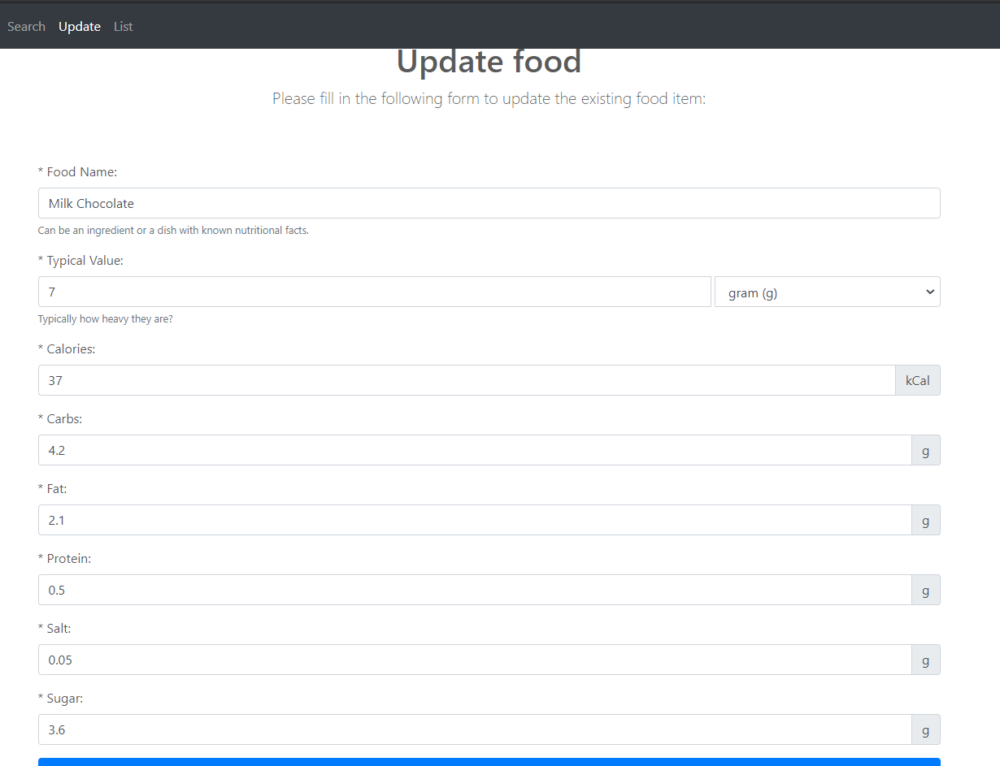

<h1 align="center">
  <a href="https://zach-nodejs-caloriebuddy.herokuapp.com/"></a>
  <br>
  Databases, Network and the Web
  <br>
  Coursework for Midterm:
  <br>
  CalorieBuddy
  <br>
  Documentation Report
  <br>
</h1>

Written & Developed by [Zach, Siu Him CHAN](https://www.linkedin.com/in/zach-chan-hk/)
(SN : **190340436**)

The website is avaliable [here on Heroku](https://zach-nodejs-caloriebuddy.herokuapp.com/), or [here on Coursera](https://vrvajwyy.coursera-apps.org/topic7/mid-term/).

## STATEMENT
By the time of implementation and deployment, mysql service on Coursera is down, such that so many students cannot connect to the database successfully. You can find relevent posts from Slack #cm2040-databases-networks-web. Here is an example post that we all suffer by that time:
Click [here](https://londoncs.slack.com/archives/CU6FK1W75/p1608912547311200) to view the post on Slack.
This is the reason why I also used Heroku for deployment instead.

## Table of Contents

<!-- toc -->

- [STATEMENT](#statement)
- [Table of Contents](#table-of-contents)
- [Introduction](#introduction)
  - [What is CalorieBuddy?](#what-is-caloriebuddy)
  - [Web App Structure](#web-app-structure)
  - [Source Code Structure](#source-code-structure)
- [List of Requirements](#list-of-requirements)
  - [**R1: Home Page**](#r1-home-page)
    - [**R1A**](#r1a)
    - [**R1B**](#r1b)
  - [**R2: About Page**](#r2-about-page)
    - [**R2A**](#r2a)
  - [**R3: Add food page**](#r3-add-food-page)
    - [**R3A**](#r3a)
    - [**R3B**](#r3b)
    - [**R3C**](#r3c)
  - [**R4: Search food page**](#r4-search-food-page)
    - [**R4A**](#r4a)
    - [**R4B**](#r4b)
    - [**R4C**](#r4c)
  - [**R5: Update food page**](#r5-update-food-page)
    - [**R5A**](#r5a)
    - [**R5B**](#r5b)
    - [**R5C**](#r5c)
  - [**R6: List foods page**](#r6-list-foods-page)
    - [**R6A**](#r6a)
    - [**R6B**](#r6b)
    - [**R6C**](#r6c)
- [Database Structure](#database-structure)
  - [**Tables**](#tables)
    - [**foods**](#foods)
- [Conclusion](#conclusion)
  - [**What I have learnt**](#what-i-have-learnt)
  - [**Future development**](#future-development)

<!-- tocstop -->

## Introduction

### What is CalorieBuddy?

CalorieBuddy is a web application, which functions as a digital calorie counter, aiming to help people manage their diet by displaying nutritional
facts including calories, carbs, fat, protein, salt and sugar in a recipe based on food ingredients in
the recipe. Essentially the dynamic web application interacts with users to calculate and display nutritional facts including calories for their recipes or meals based on food ingredients in the recipe or the meal.

### Web App Structure

```plain
Navigation Bar
Search Bar
Home Page
├── About Page
├── Add Food Page
│   └── Add Result Page
├── Search Food Page
│   └── Search Results Page
├── Update Food Page
│   └── Update Result Page
├── List Food Page
└── 404 Not Found Page
Footer
```

### Source Code Structure

In the source code zip folder, you should see this general structure. The `index.js` is written in Node.js as an entry point to the web app. The assets folder contains client-side css, js and images, while index.js and routes/main.js contains the major server-side Node.js coding to make the app running. The html in views and partials folder contains ejs to render the results from the server-side. They also contains client-side javascript using script tags.

```plain
$ tree .
.
├─index.js
├─package-lock.json
├─package.json
├─routes
│      main.js
├─views
│   │  404.html
│   │  about.html
│   │  addfood.html
│   │  error.html
│   │  foodadded.html
│   │  fooddeleted.html
│   │  foodupdated.html
│   │  index.html
│   │  list.html
│   │  README.txt
│   │  search.html
│   │  update.html
│   │  _Layout.html
│   │
│   ├─assets
│   │  ├─css
│   │  │      bootstrap.min.css
│   │  │      carousel.css
│   │  │      font-awesome.min.css
│   │  ├─images
│   │  │      ...
│   │  └─js
│   │          bootstrap.min.js
│   │          holder.min.js
│   │          jquery-3.2.1.slim.min.js
│   │          jquery.touchSwipe.min.js
│   │          popper.min.js
│   └─partials
│           card.html
│           features.html
│           footer.html
│           form.html
│           header.html
└── node_modules
    ├── ...
    └── ...
```

## List of Requirements

### [**R1: Home Page**](https://zach-nodejs-caloriebuddy.herokuapp.com/)
#### **R1A**
*R1A: Display the name of the web application.*

Home Page is at ./. This route simply renders views\index.html. You can find the routing handler on line 10 in main.js.

In the carousel, I displayed the name with h1 tag to make it eye catchy. You can find the name on line 11 in index.html:
```html
<h1>Calorie Buddy.</h1>
```
You can also find it on the Home Page (circled in red):


#### **R1B**
*R1B: Display links to other pages or a navigation bar that contains links to other pages.*

On the Home page, you can see a styled navbar at the top that contains links to the other pages:


You can find the corresponding header navbar coding in views\partials\header.html. It is used by views\\_Layout.html, and then wrapped by views\index.html.

Each link in the navbar is like this in the code, they are 'a' tags which points to corresponding endpoints, e.g. "About" points to ./about endpoint. The routing of these endpoints are handled by routes\main.js in the server side. From the below code, you can see I used ejs to detemine the styling if they involve variables that the server side Node.js used.
```html
<li class="nav-item <% if (title === 'About') { %>active<% } %>">
  <a class="nav-link" href="./about">About
      <% if (title === 'About') { %><span class="sr-only">(current)</span> <% } %>
  </a>
</li>
```

### [**R2: About Page**](https://zach-nodejs-caloriebuddy.herokuapp.com/about)
#### **R2A**
*R2A: Display information about the web application including your name as the developer. Display a link to the home page or a navigation bar that contains links to other pages.*

You can find the about page at ./about. This route simply renders views\about.html. You can find the routing handler on line 20 in main.js.

I have done the about page using a static html web page. As for the design, the content is divided into 5 sections: heading, links to other pages, purpose of the app, description of the app and the developer information. You can view views\about.html to see the coding to do it.

You can find information about the web app on the About Page here:


You can find my name as the developer on the About Page at the bottom of the About Page:


Since all pages uses the same _Layout.html, they share the same navbar that contains links to other pages.

### [**R3: Add food page**](https://zach-nodejs-caloriebuddy.herokuapp.com/addfood)
#### **R3A**
*R3A: Display a form to users to add a new food item to the database. The form should consist of the following items: name, typical values, unit of the typical value, calories, carbs, fat, protein, salt, and sugar. Display a link to the home page or a navigation bar that contains links to other pages.*

You can find the form on the add food page here at ./addfood. This route simply renders views\addfood.html. You can find the routing handler on line 30 in main.js.

The form contains all the field items specified and looks like this:


The \* on the form means the field is mandatory. So all fields are required to submit a food item.

For each field item, the front-end coding looks like this:

```html
<div class="form-group">
    <label for="calories">* Calories: </label>
    <div class="input-group">
        <input id="calories" name="calories" type="number" class="form-control" placeholder="Calories" step=".01" max="999.99" value="<%- food.calories %>" required>
        <div class="input-group-append">
            <span class="input-group-text">kCal</span>
        </div>
    </div>
</div>
```
This code displays a label and an input field for the field item "Calories".
The coding varies when the field types are different. Calories, Carbs, Fat, Protein, Salt and Sugar are all numerical fields, while food name is a string field. Unit of the typical value is a dropdown select field. Users can use g, L, tbsp, cup or oz. as the unit.

Since all pages uses the same _Layout.html, they share the same navbar that contains links to other pages.

#### **R3B**
*R3B: Collect form data to be passed to the back-end (database) and store food items in the database. Each food item consists of the following fields: name, typical values, unit of the typical value, calories, carbs, fat, protein, salt, and sugar*

On clicking the submit button of the form, it posts to ./foodadded route:
```html
<form id="form" method="POST" action="
    <% if (title === 'Update'){ %>
        ./foodupdated
    <% } else { %>
        ./foodadded
    <% } %>
">
```
The if statement in the ejs is just a switch for different pages. Since this is the form for Add Food Page, the POST action equals ./foodadded route.

The form data then is collected and handled by ./foodadded route handler in main.js. On line 40:
```js
app.post("/foodadded", function(req, res){
    let sqlquery = "INSERT INTO foods (name, typicalValue, unit, calories, carbs, fat, protein, salt, sugar) VALUES (?,?,?,?,?,?,?,?,?);";
    let newrecord = [req.body.name, req.body.typicalValue, req.body.unit, req.body.calories, req.body.carbs, req.body.fat, req.body.protein, req.body.salt, req.body.sugar];

    db.query(sqlquery, newrecord, (err, result) => {
        if (err) {
            console.error(err.message);
            res.render(viewsDir + "error.html", { title: 'Error', error: err.message});
        } else {
            req.body.id = result.insertId; // SELECT LAST_INSERT_ID();
            res.render(viewsDir + "foodadded.html", { title: 'AddFood', food: req.body});
        }; 
    });
});
```
The SQL statement is defined using the request body and is executed using db.query() function. The INSERT SQL statement inserts a food record to the foods table in the database. Using this flow, we store food items in the database. The table requires all fields non-null to be able to create a food record. If error occurs, it will be redirected to the Error page, displaying the error message.

Take a food item say Milk Chocolate as an example, I inputted the data to the form:


After form submittion, the food record is stored in the database. By using MySQL Workbench, we can see the record in the table:


#### **R3C**
*R3C: Display a message indicating that add operation has been done.*

After adding the food item to the database, from the code we can see if everything is fine, it renders views\foodadded.html with request body, which contains the added food item data. On line 11 of the html file, it used:
```html
<%- include('./partials/card.html') %>
```
to render html code in views\partials\card.html. For the card, I used a table to show the food data like this:
```html
<table>
  <tr>
      <th scope="row">Calories</th>
      <td><span class="calories"><%= food.calories %></span> kCal</td>
  </tr>
  ...
</table>
```
The "food" contains the food id from the SQL result, and also the food item data from the request body in the ./foodadded routing handler.

Screenshot of the add food result page:


At the bottom of each food card, we have "Edit" and "Delete" buttons to redirect to ./update and ./delete correspondingly, using food id as a request query in the GET method.

### [**R4: Search food page**](https://zach-nodejs-caloriebuddy.herokuapp.com/search)
#### **R4A**
*R4A: Display a form to users to search for a food item in the database. 'The form should contain just one field - to input the name of the food item'. Display a link to the home page or a navigation bar that contains links to other pages.*

You can find the form on the search food page at ./search. This route simply renders views\search.html. You can find the routing handler on line 68 in main.js.

The form contains only one field: the name of the food item to be searched. It looks like this:


The name field is required to submit the search food form.

HTML code of the form looks like this in views\search.html:

```html
<form action="./search-result" method="GET">
  <div class="input-group">
    <input id="search-box" class="form-control" type="text" name="keyword" value="" placeholder="Search by food name..." required>
    <div class="input-group-append">
      <button class="btn btn-secondary" type="submit">
        <i class="fa fa-search"></i>
      </button>
    </div>
  </div>
</form>
```
On form submittion, the form data will be submit to ./search-result route.

Since all pages uses the same _Layout.html, they share the same navbar that contains links to other pages.

#### **R4B**
*R4B: Collect form data to be passed to the back-end (database) and search the database based on the food name collected from the form. If food found, display a template file (ejs, pug, etc) including data related to the food found in the database to users; name, typical values, unit of the typical value, calories, carbs, fat, protein, salt, and sugar. Display a message to the user, if not found.*

On clicking the search button of the form, it posts to ./search-result route.

The form data then is collected and handled by ./search-result route handler in main.js. On line 78:
```js
app.get("/search-result", (req, res) => {
    let word = ['%' + req.query.keyword + '%'];
    let sqlquery = "SELECT * FROM foods WHERE name like ? ORDER BY name;";

    db.query(sqlquery, word, (err, result) => {
        if (err) {
            var error_msg = "No food item found with the keyword you have entered: " + req.query.keyword + "; error: "+ err.message;
            console.error(error_msg);
            res.render(viewsDir + "error.html", { title: 'Search', error: error_msg});
        } else {
            res.render (viewsDir + 'list.html', { title: 'Search', keyword: req.query.keyword, food_items: result });
        }
    });
});
```
The SQL statement is defined using the request body and is executed using db.query() function. The SELECT SQL statement searches for all food items that contains the food name keyword. '%' wraps around the keyword means to match any word that contains the keyword. ORDER BY name allows the returned food items to be in alphabetical order by the food name, for better display.

If no search results or error occurs, it will be redirected to the Error page, displaying the error message. If there are food items that matches the criteria, it renders views\list.html with the keyword and the returned food item(s) data.

Say I want to search for "Milk Chocolate" I created before, I inputted the keyword to the search bar, then the following search result page is returned:


In views\list.html, similar to add food result page, it renders food cards using views\partials\card.html to display the food data, using ejs.

To test error page, I search using "Dark Chocolate" as keyword. Since I didn't add any food item named "Dark Chocolate", it returns "No food item found" page like this:


#### **R4C**
*R4C: Going beyond, search food items containing part of the food name as well as the whole food name. As an example, when searching for ‘bread’ display data related to ‘pitta bread’, ‘white bread’, ‘wholemeal bread’, and so on.*

To test this functionality I search using keyword = "a", and found the following 3 food items in the search results:


Since all 3 names contain the word "a", this functionality works on my search bar.

As I have mentioned in R4B, I achieve this by wrapping '%' around the keyword in the SQL statement, using SQL keyword "LIKE":
```sql
SELECT * FROM foods WHERE name like '%a%' ORDER BY name;
```

### [**R5: Update food page**](https://zach-nodejs-caloriebuddy.herokuapp.com/update)
#### **R5A**
*R5A: Display search food form. Display a link to the home page or a navigation bar that contains links to other pages.*

This part is exactly the same as R4A.

You can find the form on the update food page at ./update. Without any query parameters in the url, this route simply renders views\search.html with customized text, to distinguish it is from update page.

The form contains only one field: the name of the food item to be searched. It looks like this:


On form submittion, the form data will be submit to ./search-result route.

Since all pages uses the same _Layout.html, they share the same navbar that contains links to other pages.

#### **R5B**
*R5B: If food found, display data related to the food found in the database to users including name, typical values, unit of the typical value, calories, carbs, fat, protein, salt, and sugar in forms so users can update each field. Display a message to the user if not found. Collect form data to be passed to the back-end (database) and store updated food items in the database. Display a message indicating the update operation has been done.*

The first half of this part is exactly the same as R4B.

On clicking the search button of the form, it posts to ./search-result route.

The form data then is collected and handled by ./search-result route handler in main.js. Please refer to part R4B for the coding of the routing handler.

If no search results or error occurs, it will be redirected to the Error page, displaying the error message.


If there are food items that matches the criteria, it renders views\list.html with the keyword and the returned food item(s) data.

Say I want to update "Milk Chocolate" I created before, I inputted the keyword to the search bar, here's the food card returned:


For each food card you see in this web app, notice at the bottom there are two buttons: "Edit" and "Delete". Clicking on the "Edit" button will bring you to the Update Food Form. I did so using a tag with food id populated by ejs.
```html
<a href="./update?id=<%- food.id %>">Edit</a>
```

When the browser goes to ./update?id=..., the following routing handler takes place: (Extracted from main.js line 106)
```js
app.get("/update", function(req, res){
    if (req.query.id) {
        let word = [req.query.id];
        let sqlquery = "SELECT * FROM foods WHERE id = ?;";

        db.query(sqlquery, word, (err, result) => {
            if (err) {
                var error_msg = "An error has occured. Please see the following error message: " + err.message;
                console.error(error_msg);
                return res.render(viewsDir + "error.html", { title: 'Update', error: error_msg});
            } else {
                if (result.length === 0) {
                    var error_msg = "No food item found with id = " + req.query.id + ", maybe it has already been deleted.";
                    return res.render(viewsDir + "error.html", { title: 'Update', error: error_msg});
                }
                return res.render(viewsDir + "update.html", { title: 'Update', food: result[0] }); // populate the result to update form
            }
        });
    }
    else {
        res.render(viewsDir + "search.html", { title: 'Update'});
    }
});
```

Basically it searches through the foods table to find food items with the id specified in the query parameter, by executing the SQL statement. If it cannot find any food items with the id, the following error page will be returned:


If the food item with the id exists, it will render views\update.html which populate the food data to the update form like this:



If you look at views\update.html, it simply renders views\partials\form.html using ejs:
```html
<%- include('./partials/form.html') %>
```

If you look at views\partials\form.html, for each food item field it looks like this:
```html
<div class="form-group">
    <label for="calories">* Calories: </label>
    <div class="input-group">
        <input id="calories" name="calories" type="number" class="form-control" placeholder="Calories" step=".01" max="999.99" value="<%- food.calories %>" required>
        <div class="input-group-append">
            <span class="input-group-text">kCal</span>
        </div>
    </div>
</div>
```
You can see it populates the food data into the form using ejs by filling in the value attribute of the input tag. 

The following part is similar to R3B.

On clicking the submit button of the form, it posts to ./foodupdated route:
```html
<form id="form" method="POST" action="
    <% if (title === 'Update'){ %>
        ./foodupdated
    <% } else { %>
        ./foodadded
    <% } %>
">
```
The if statement in the ejs is just a switch for different pages. Since this is the form for Update Food Page, the POST action equals ./foodupdated route.

The form data then is collected and handled by ./foodupdated route handler in main.js. On line 143:
```js
app.post("/foodupdated", function(req, res){
    let sqlquery = "UPDATE foods SET name=?, typicalValue=?, unit=?, calories=?, carbs=?, fat=?, protein=?, salt=?, sugar=? WHERE id=?;";
    let update_record = [req.body.name, req.body.typicalValue, req.body.unit, req.body.calories, req.body.carbs, req.body.fat, req.body.protein, req.body.salt, req.body.sugar, req.body.id];

    db.query(sqlquery, update_record, (err, result) => {
        if (err) {
            console.error(err.message);
            res.render(viewsDir + "error.html", { title: 'Error', error: err.message});
        } else {
            res.render(viewsDir + "foodupdated.html", { title: 'Update', food: req.body});
        }; 
    });
});
```
The SQL statement is defined using the request body and is executed using db.query() function. The UPDATE SQL statement updates the food record with the specified id on the foods table in the database. Using this flow, we store updated food items in the database. The table requires all fields non-null to be able to create a food record. If error occurs, it will be redirected to the Error page, displaying the error message.

Take a food item say Milk Chocolate as an example, I updated the calories of it from 37 to 100 in the form:


After form submittion, the food record is stored in the database. By using MySQL Workbench, we can see the record in the table:


And views\foodupdated.html will be rendered using a card with the updated food data:


#### **R5C**
*R5C: going beyond by implementing a delete button to delete the whole record, when the delete button is pressed, it is good practice to ask 'Are you sure?' and then delete the food item from the database, and display a message indicating the delete has been done.*

As I have mentioned before, "Delete" button exists at the bottom-right of each food card:


The code is in views\partials\card.html. On line 51 you can see the button html:
```html
<a href="" class="delete" data-toggle="modal" data-target="#cardModal-<%- food.id %>">Delete</a>
```

You can see instead of redirecting to any route, a div with class modal will be pop up to ask 'Are you sure?' first. The prompt looks like this:


When you click "DELETE" in the prompt, the following form (card.html line 70) will be submitted:
```html
<form id="delete_form" method="POST" action="./fooddeleted">
  <input id="id" name="id" type="hidden" value="<%- food.id %>" required>
  <input id="name" name="name" type="hidden" value="<%- food.name %>" required>
  <button type="submit" class="btn btn-danger">DELETE</button>
</form>
```

This form wraps food id and food name up and send to ./fooddeleted route using HTTP POST method.

And the route handler looks like this in the code in routes\main.js: (Extracted from main.js line 195)
```js
app.post("/fooddeleted", function(req, res){
    let sqlquery = "DELETE FROM foods WHERE id=?;";
    let delete_record = [req.body.id];

    db.query(sqlquery, delete_record, (err, result) => {
        if (err) {
            console.error(err.message);
            res.render(viewsDir + "error.html", { title: 'Error', error: err.message});
        } else {
            res.render(viewsDir + "fooddeleted.html", { title: 'Food Deleted', food: req.body});
        }; 
    });
});
```
The SQL statement is defined using the request body and is executed using db.query() function. The DELETE SQL statement deletes the food record with the specified id on the foods table in the database. Using this flow, we can delete specified food items in the database. If error occurs, it will be redirected to the Error page, displaying the error message.

Upon successful deletion, views\fooddeleted.html will be rendered to display a message indicating the delete has been done:


### [**R6: List foods page**](https://zach-nodejs-caloriebuddy.herokuapp.com/list)
#### **R6A**
*R6A: Display all foods stored in the database including name, typical values, unit of the typical value, calories, carbs, fat, protein, salt, and sugar, sorted by name.*

When the browser goes to ./list route, the following route handler takes place: (Extracted from main.js line 170)
```js
app.get("/list", (req, res) => {
    let sqlquery = "SELECT * FROM foods ORDER BY name;";

    db.query(sqlquery, (err, result) => {
        if (err) {
            res.redirect("/");
        }
        res.render(viewsDir + "list.html", {title: 'List', food_items: result});
    });
});
```
The SQL statement is defined using the request body and is executed using db.query() function. The SELECT SQL statement searches for all food items in the foods table. ORDER BY name allows the returned food items to be sorted in alphabetical order by the food name, for better display.

If server error occurs that it cannot list, it redirects to the Home Page.

If everything sounds fine, views\list.html will be rendered with the array of food items. It looks like this:


#### **R6B**
*R6B: Display a link to the home page or a navigation bar that contains links to other pages.*

Since all pages uses the same _Layout.html, they share the same navbar that contains links to other pages:


#### **R6C**
*R6C: going beyond by letting users select some food items (e.g. by displaying a checkbox next to each food item and letting the user input the amount of each food item in the recipe e.g. 2x100 g flour). Then collect the name of all selected foods and calculate the sum of the nutritional information (calories, carbs, fat, protein, salt, and sugar) related to all selected food items for a recipe or a meal and display them as ‘nutritional information and calorie count of a recipe or a meal’. Please note, it is not necessary to store recipes or meals in the database.*

I achieved this requirement purely using front-end coding. There are no operation on the back-end side related to the calculation.

On the list page, you can see there is a big button "Calculate Calories!". And for each card, after the table of food data, there is an input for user to input how many of the food item they want to select to be involved in the calculation of the recipe:


The "Calculate Calories!" has the following HTML code:
```html
<button id="calButton" type="submit" class="btn btn-primary btn-block"><u>Cal</u>culate <u>Cal</u>ories!</button>
```

The button on-click event listener is registered in front-end javascript with jQuery on views\\_Layout.html line 60:
```js
$(function() {
    $('#calButton').click(function() {
        popupCalculation();
    });
});
```

The function popupCalculation() will calculate the sum of muliplication of amount and each food field data. Then it popup a div to display the sum of the nutritional information as ‘nutritional information and calorie count of a recipe or a meal’ using the following js code:
```js
summaryCount.calories += amount * parseFloat(food.calories);
...
$("#calModal").modal("show");
```
For details, please see _Layout.html line 70.

After calculation, the modal containing the summary will be popup like this:


## Database Structure

This part aims to summarize the structure for the table(s) including purpose, field names, and data types for each table. 

### **Tables**
The database only contains 1 table: foods.

#### **foods**
The purpose of this table "foods" is to store food items.

| Field Name   | Data Type(Size) | Unsigned | Not Null | Auto Increment | Primary Key | Unique Key |
|--------------|-----------------|:--------:|:--------:|:--------------:|:-----------:|:----------:|
| id           | Integer(1)      |          |     ✔    |       ✔       |      ✔      |      ✔    |
| name         | Varchar(100)    |          |     ✔    |                |             |            |
| typicalValue | Decimal(5,2)    |     ✔    |     ✔   |                |             |            |
| unit         | Varchar(50)     |          |     ✔    |                |             |            |
| calories     | Decimal(5,2)    |     ✔    |     ✔   |                |             |            |
| carbs        | Decimal(5,2)    |     ✔    |     ✔   |                |             |            |
| fat          | Decimal(5,2)    |     ✔    |     ✔   |                |             |            |
| protein      | Decimal(5,2)    |     ✔    |     ✔   |                |             |            |
| salt         | Decimal(5,2)    |     ✔    |     ✔   |                |             |            |
| sugar        | Decimal(5,2)    |     ✔    |     ✔   |                |             |            |

| Field Name   | Description                                       | 
|--------------|---------------------------------------------------|
| id           | unique identification number for the food item    |
| name         | name of the food item                             |
| typicalValue | typical value of the food item                    |
| unit         | unit of the typical value of the food item        |
| calories     | how many units of calories the food item has      |
| carbs        | how many units of carbohydrates the food item has |
| fat          | how many units of fat the food item has           |
| protein      | how many units of protein the food item has       |
| salt         | how many units of salt the food item has          |
| sugar        | how many units of sugar the food item has         |

## Conclusion


### **What I have learnt**
I have experience in developing web applications before this course. But this time I participate in the whole software development process on my own, from designing to implementation, and to maintenance. I also have a taste of Full Stack Web Developer, by developing Node.js Express Server with ejs, and front-end coding using HTML, CSS and JS. I have also learnt CRUD a database using SQL statements and how to execute using Node.js. I found the interaction and communication between different layers and langauages amazing and interesting. This is a very good professional training for me as a programmer.

Writing this report also improves my documentation skills. I have also learnt how to write in Markdown Langauage (md) to generate this report. This skill will be essential when I have to document README markdown files for different projects.

### **Future development**
Currently we can only list food nutrition data from our database. Users have to contribute to input the data to make it informative. Otherwise it will be empty or does not have enough food items. 

We can utilize APIs from the Internet (Application Programming Interfaces) to solve this problem. The data will be from a third-party database, which is very informative. Some providers have written API that can be fetched using HTTP methods. We can fetch their returned data and display the data in our way, such that we can list the food data using food cards.

The only drawback of this suggestion is that the food data from the database cannot be modified or deleted. However, users can still create their own food items, modify and delete the custom food items. The app will have to tell the difference between food items from APIs and custom food items.

A good API for official food nutrition data would be the API from USDA (U.S. Department of Agriculture). The Guide of this API can be found [here](https://fdc.nal.usda.gov/api-guide.html).